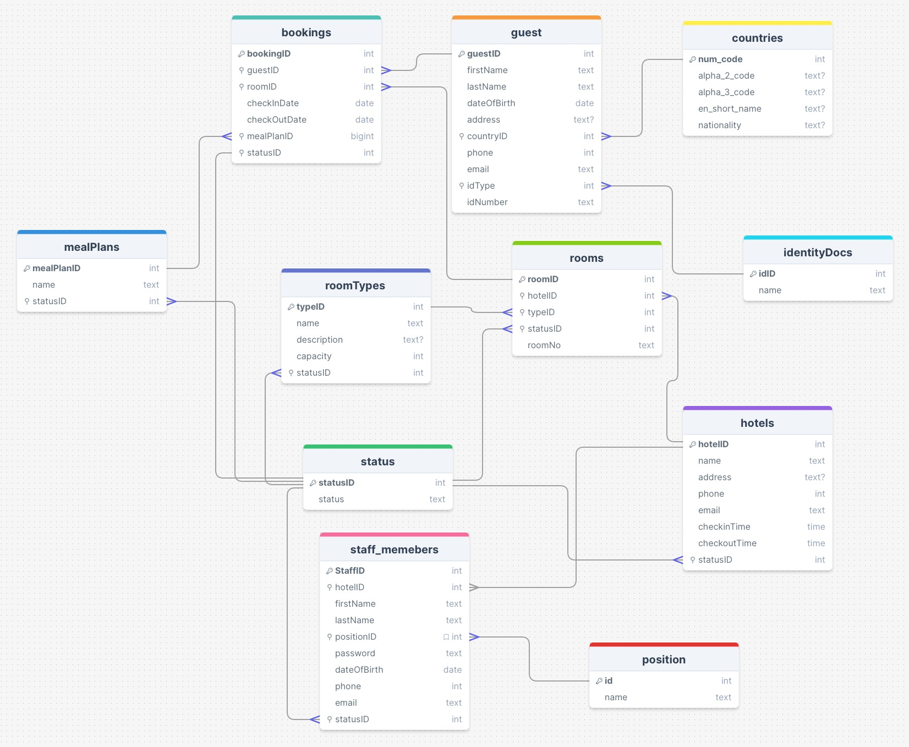

[![Contributors][contributors-shield]][contributors-url]
[![Forks][forks-shield]][forks-url]
[![Stargazers][stars-shield]][stars-url]
[![Issues][issues-shield]][issues-url]
[![LinkedIn][linkedin-shield]][linkedin-url1]

<!-- PROJECT LOGO -->
# Hotel Guest Information System
#### Video Demo:  <URL HERE>
#### Description:
<br />
<div align="center">
  <h2 align="center">Hotel Guest Information System</h2>
  <h5 align="center">Université Paris Cité - Paris - France</h5>
  <h6 aligh="center">Colombo, Sri Lanka</h6>

  <p align="center">
    Anton Dilan Croos Warnakulasuriya
    <br />
    <a href="https://github.com/dilancroos/cs50_project"><strong>Explore the docs »</strong></a>
    <br />
    <br />
    ·
    <a href="https://github.com/dilancroos/cs50_project/issues">Report Bug</a>
    ·
    <a href="https://github.com/dilancroos/cs50_project/issues">Request Feature</a>
  </p>
</div>

<!-- TABLE OF CONTENTS -->
<details>
  <summary>Table of Contents</summary>
  <ol>
    <li>
      <a href="#about-the-assesments">About The Project</a>
      <ul>
        <li>
          <a href="#overview">Overview</a>
        </li>
        <li>
          <a href="#features">Features</a>
        </li>
        <li>
          <a href="#future">Future</a>
        </li>
      </ul>
    </li>
    <li>
      <a href="#technologies-used">Technology Used</a>
    </li>
    <li>
      <a href="#getting-started">Getting Started</a>
      <ul>
        <li>
          <a href="#prerequisites">Prerequisites</a>
        </li>
        <li>
          <a href="#installation">Installation</a>
        </li>
      </ul>
    </li>
    <li>
      <a href="#usage">Usage</a>
    </li>
    <li>
      <a href="#contact">Contact</a>
    </li>
    <li>
      <a href="#acknowledgments">Acknowledgments</a>
    </li>
  </ol>
</details>

<!-- ABOUT THE PROJECT -->

## About The Assesments

### Overview

I chose to create the Hotel Guest Information Management System to help my father manage his small motel. By developing this system, I wanted to make it easier for him to handle guest information and bookings. The goal is to use the collected data to improve the services we offer to guests. This system helps keep everything organized and allows us to see where we can make things better for our guests.

### Features
** G - Can be accessed by Ground Staff, Managers and System administers.
** M - Can be accessed by Managers and System administers.
** A - Can only be accessed by System adminiters.

1. Guest Management (guests.html)
- Guest Information (G): Store and manage detailed information about guests, including personal details and identification number. It was added due to the regulatory need of the country to collect identification details of all guests. Staff of any property can see the guest details so that the guest details won't be duplicated.
- Add New Guest (G): Add new guest information.
- Booking History (G): Track and display the booking history of each guest with the total number of nights spent at the property.
- Edit guest details (M): Edit guest details.
- Delete guest details (A): Delete guest details if requested. The booking details of that guest will be allocated to "Unknown guest". (I was thinking of the implication of deletion of guest details due to regulations, but went ahead with in due to privacy concerns.)
- New bookings (G): can also be made from the guests page with the details being carried forward.

2. Booking Management (bookings.htlm)
- Booking Records (G): Manage and store booking information, including guest details, room allocation, check-in and check-out dates, meal plans and the status of bookings.
- New Booking (G)

3. Room Management (rooms.html)
- Room Details (G): Maintain comprehensive details about each room, such as Hotel, room type, room number and status. The staff only sees rooms allocated to the hotel they are assigned to. In the feature it is planned as an upgrade.
- Add New Rooms (M)
- Edit Room Details (M)

4. Hotel, Room Type and Meal Plan Management
- Hotel Details (M): Maintain information about different hotels in the system, including their chechin, checkout times and status.
- Add New Hotel (A)
- Edit Hotel Details (A)
- Room Types (M): Manage various room types available in the hotel, including their capacity and status.
- Edit Room Type detials (A)
- Meal Plans (M): View different meal plans offered to guests, along with their status.

5. Staff Management
- Staff Details (M): Store and manage information about staff members, including their roles, assigned hotel, and status.
- Add New Staff (M)
- Edit Staff details (A)

6. Log-in and Log-out

7. Change Password

8. User Access Control (with a SW error message)

### Future

- In the future, I plan to add several features to the Hotel Guest Information Management System to make it even more useful. Some of the improvements I expect to make include:
- Validation on input methods to standerdise the responses. (didn't add this due to different standards in countries)
- Online Booking Integration: Allow guests to book rooms directly through a website, making the process more convenient. (using third party booking service with an API)
- Automated Email Notifications: Send automatic confirmation and reminder emails to guests about their bookings.
- Advanced Reporting: Add more detailed reports and analytics to help identify trends and areas for improvement.
- Mobile App/Mobile friendly WebApp: Develop a mobile app version of the system so that staff can manage bookings and guest information on the go.
- Feedback System: Implement a feedback system where guests can rate their stay and provide suggestions for improvement.

These improvements will help further streamline operations and enhance the guest experience at the motel.

<p align="right">(<a href="#readme-top">back to top</a>)</p>

## Technologies Used

- Flask
- SQLite
- Jinja2
- HTML/CSS
- JavaScript

<p align="right">(<a href="#readme-top">back to top</a>)</p>

### SQL Schema

  - Primary Key
  - Foreign Key
   - Null Allowed
<!-- Add image -->


#### Tables

1. hotels
2. roomTypes
3. staff_members
4. mealPlans
5. bookings
6. rooms
7. guests
8. identityDocs
9. countries
10. position
11. status

<!-- GETTING STARTED -->

## Getting Started

To get a local copy up and run the application, follow these simple steps.

### Prerequisites

- Python 3.x
- Flask
- SQLite
- Jinja2

### Installation

1. Clone the repo

    ```sh
      $ git clone git@github.com:dilancroos/cs50_project.git
    ```

2. Change to the working directory

    ```sh
      $ cd cs50_project
    ```

3. Create a virtual environment .venv

    ```sh
      $ python -m venv .venv
    ```

4. Enter the virtual environment .venv

    ```sh
      $ source .venv/bin/activate
    ```

5. Install PIP packages

    ```sh
      $ pip install -r requirements.txt
    ```

<p align="right">(<a href="#readme-top">back to top</a>)</p>

<!-- USAGE EXAMPLES -->

## Usage

1. Run Flask

    ```sh
      $ flask run
    ```
  * to run in debug mode

      ```sh
        $ flask run --debug
      ```

2. Click the link to go to the Login page (eg. 127.0.0.1)

3. Access DataBase

    ```sh
      $ sqlite3 hotel.db
    ```

4. Use default username and password to enter

  - Admin: (for Hotel M)
    ```
    Username: AdminM
    password: twrhotels
    ```
  - Admin: (for Hotel N)
    ```
    Username: AdminN
    password: twrhotels
    ```
  If needed seed instructions can be found in sql.txt file

<p align="right">(<a href="#readme-top">back to top</a>)</p>

<!-- CONTACT -->

## Contact

Dilan Croos - antondilan.crooswarnakulasuriya@cri-paris.org.com

Project Link: [https://github.com/dilancroos/cs50_project](https://github.com/dilancroos/cs50_project)

Website: [https://dilancroos.com](https://dilancroos.com)

<p align="right">(<a href="#readme-top">back to top</a>)</p>

<!-- ACKNOWLEDGMENTS -->

## Acknowledgments

- Université Paris Cité & Learning Plannet Institute for getting EdX for the students.
- CS50 team for doing a bang-up job.

<p align="right">(<a href="#readme-top">back to top</a>)</p>

<!-- MARKDOWN LINKS & IMAGES -->
<!-- https://www.markdownguide.org/basic-syntax/#reference-style-links -->

[contributors-shield]: https://img.shields.io/github/contributors/dilancroos/cs50_project.svg?style=for-the-badge
[contributors-url]: https://github.com/dilancroos/cs50_project/graphs/contributors
[forks-shield]: https://img.shields.io/github/forks/dilancroos/cs50_project.svg?style=for-the-badge
[forks-url]: https://github.com/dilancroos/cs50_project/network/members
[stars-shield]: https://img.shields.io/github/stars/dilancroos/cs50_project.svg?style=for-the-badge
[stars-url]: https://github.com/dilancroos/cs50_project/stargazers
[issues-shield]: https://img.shields.io/github/issues/dilancroos/cs50_project.svg?style=for-the-badge
[issues-url]: https://github.com/dilancroos/cs50_project/issues
[license-shield]: https://img.shields.io/github/license/dilancroos/cs50_project.svg?style=for-the-badge
[license-url]: https://github.com/dilancroos/cs50_project/blob/master/LICENSE.txt
[linkedin-shield]: https://img.shields.io/badge/-LinkedIn-black.svg?style=for-the-badge&logo=linkedin&colorB=555
[linkedin-url1]: https://linkedin.com/in/antondilancrooswarnakulasuriya
[product-screenshot]: images/screenshot.png
[Next.js]: https://img.shields.io/badge/next.js-000000?style=for-the-badge&logo=nextdotjs&logoColor=white
[Next-url]: https://nextjs.org/
[React.js]: https://img.shields.io/badge/React-20232A?style=for-the-badge&logo=react&logoColor=61DAFB
[React-url]: https://reactjs.org/
[Vue.js]: https://img.shields.io/badge/Vue.js-35495E?style=for-the-badge&logo=vuedotjs&logoColor=4FC08D
[Vue-url]: https://vuejs.org/
[Angular.io]: https://img.shields.io/badge/Angular-DD0031?style=for-the-badge&logo=angular&logoColor=white
[Angular-url]: https://angular.io/
[Svelte.dev]: https://img.shields.io/badge/Svelte-4A4A55?style=for-the-badge&logo=svelte&logoColor=FF3E00
[Svelte-url]: https://svelte.dev/
[Laravel.com]: https://img.shields.io/badge/Laravel-FF2D20?style=for-the-badge&logo=laravel&logoColor=white
[Laravel-url]: https://laravel.com
[Bootstrap.com]: https://img.shields.io/badge/Bootstrap-563D7C?style=for-the-badge&logo=bootstrap&logoColor=white
[Bootstrap-url]: https://getbootstrap.com
[JQuery.com]: https://img.shields.io/badge/jQuery-0769AD?style=for-the-badge&logo=jquery&logoColor=white
[JQuery-url]: https://jquery.com
